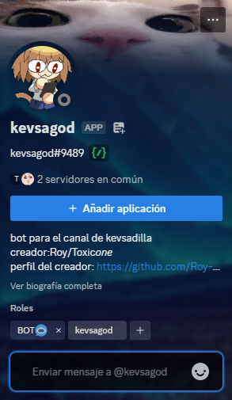
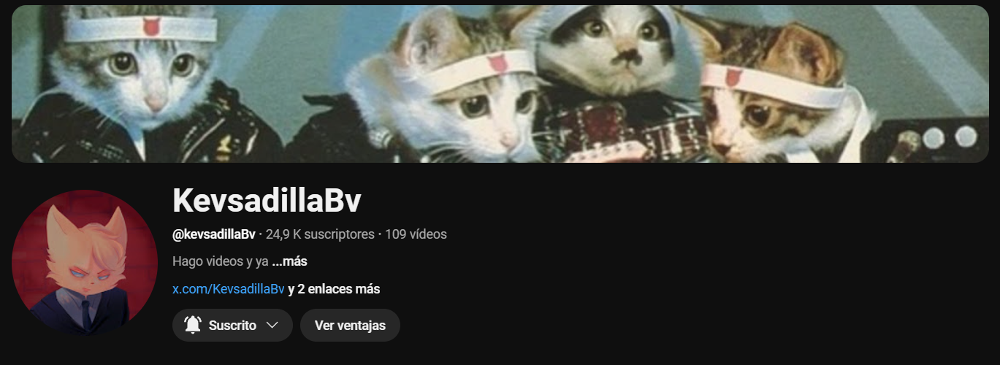
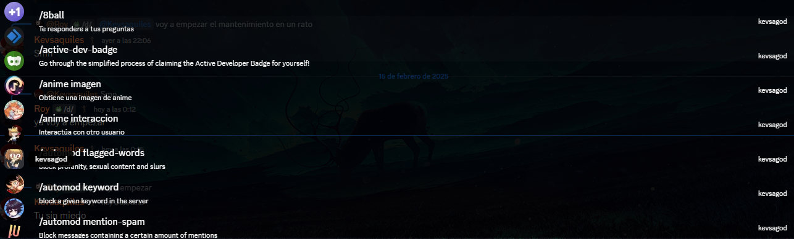

Bot de discord desarollada en js con node jsutilizando la API de discord, este vot fue creado para el servidor de Discord del youtuber kevsadilla 

*Comandos*

para usarlo es como cualquier otro bot de discord, al colocar el simbolo slash / , te saldra el menu de bot más el menu de comandos

